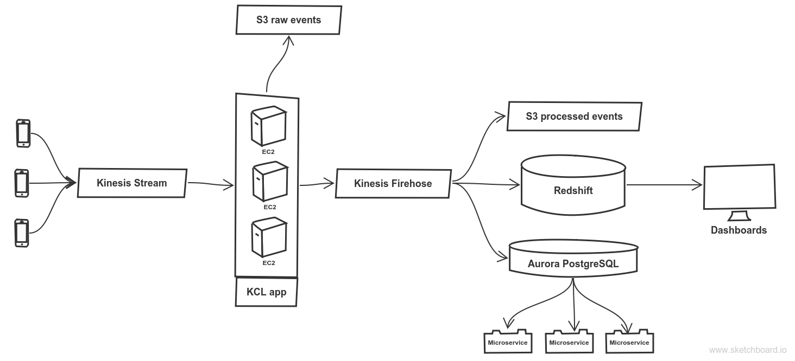
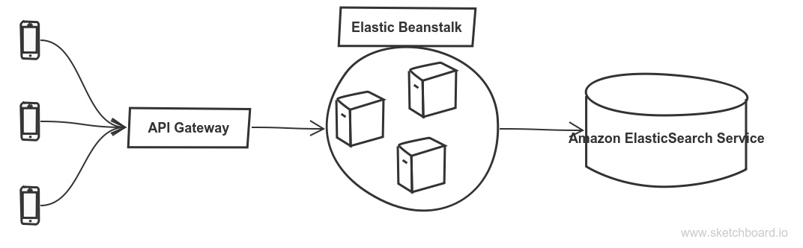

# Letgo

## 1 - Tracking API

##### Producing the events:
From the mobile application, I will leverage the Segment SDK to track the events produced by our users. It is open source, available in many languages including [Android][1] and [iOS][2], well-documented and easy to integrate.  
By default the Segment SDK is meant to be used with the Segment SaaS platform and only allows us to push events to the Segement API. Nevertheless we can simply fork our own version of the project and change the code to enable sending events to our own custom API endpoint or directly to a stream if we don't have to pass the data through an API.  


[1]: https://segment.com/docs/sources/mobile/android/
[2]: https://segment.com/docs/sources/mobile/ios/

##### Events format:
Here as well I will take inspiration from the Segment documentation and use the following schema:
```javascript
"event": {
	"type": "Lead",
	"timestamp": "2018-01-25T19:08:52.422Z",
    "messageId": "ajs-d3fe2aa7bdd82660af8ed7d50d61edc3"
	"context": {
    	"metadata": "android version; hardware; user geolocation; ..."
     },
     "properties": {
     	"data": "business data related to the events"
     }
}
```
The format is self-explanatory, at the root we have the type of event, the timestamp when it was generated and an unique ID. Then we have the context which contains any metadata (let's say not business related data) and the properties which gathers all the actual data such as what type of item the lead was generated for, what is the price or the title of the classified ad.

##### Architecture:
1. If we own the code producing the events, we can directly write to a stream instead of passing through an API. This choice avoids us to pay for the API infrastructure and makes the overall architecture simpler and easier to maintain.  
2. Once the events are in the stream I will process them with a [KCL appl][3] hosted on EC2 spot instances in an auto-scaling group to handle any unexpected peak of traffic. Thanks to using spot instances with a right bid price, this solution is generally cheaper than a Spark Streaming app on EMR or a bunch of AWS Lambda functions.   
3. The code of the KCL app will start by persisting the raw events to S3 as a backup so that if we need to recover from a failure and reprocess some events in the future we can. Then it will sanitize the events, coerce the type, operate a few checks and reports any issue using [Sentry][4].  
4. Finally there will be 2 sinks after the KCL app:  
- a Kinesis Firehose that will output the events processed to S3 as a safe backup and to Redshift which is the database I choose for the analytics purpose like generating reports or aggregating over user groups. To reduce the costs we will rely on AWS Spectrum to keep all the historical data in our Redshift cluster. For instance the last month will actually live in Redshift and any older data will use Spectrum. The design of the data warehouse in Redshift is out of scope but I would probably go for an [event/materialized view model][5].  

- an Aurora PostgreSQL database to expose those data in a more performant way to some microservices. This database will be indexed on date and/or type of events depending on the queries supposed to be run there. Here I also considered to use DynamoDB but I     preferred going for Postgre because DyanmoDB can get pretty expensive for read intensive applications and here we are speaking about several microservices so it's a no go. Also the query language of DynamoDB has the reputation of being nasty and hard to work with thus going for classic SQL will make the life of people querying this database easier.



[3]: https://docs.aws.amazon.com/streams/latest/dev/developing-consumers-with-kcl.html
[4]: https://sentry.io/welcome/
[5]: https://docs.microsoft.com/en-us/azure/architecture/patterns/materialized-view

## 2 - Real-time statistics
Here I will use AWS Kinesis Analytics on the stream ingesting the events because the metrics to compute are very basic so it can easily be achieved with a bit of SQL. Deploying a proper streaming application (whether KCL, lambda functions or Spark streaming)  for such a simple use case would be an overkill whereas, thanks to Kinesis Analytics, we avoid dealing with any infrastructure hassle and we still get the results we are looking for.  
In case of a bug resulting in wrong metrics being computed for several hours I would do the following : 
- stop processing the stream.
- delete the hours of wrong data in the sink used after Kinesis Analytics (it can be Redshift, S3 or Elasticsearch).
- restart the processing of the stream with the right version of the code and from the point in time where the bug was inserted. The last hours of data won't be available during the time we reprocess the stream but I don't see it as a big deal because they were wrong anyway. 

This is the main advantage of streams, being able to read data as many times as we want and replay any processing.  

  

## 3 - Search engine
##### Architecture:
I considered three possible search engines to empower the search capability of our app : Elasticsearch, Algolia and Solr.  
Algolia is very convenient to quickly roll a product out but might not be flexible enough for more advanced use cases. That can become a blocker along the way thus I discarded it.
Choosing between Solr or Elasticsearch would deserve some more thoughts. To be honest I went for Elasticsearch for its easiness of hosting on AWS and because it is the technology I am most familiar with.



The schema is straightforward, my plan is to have some API Gateway endpoints backed by an AWS Elastic Beanstalk backend querying an Elasticsearch cluster also hosted on AWS (Amazon Elasticsearch Service). Elastic Beanstalk is convenient here as it deals with load balancing and auto scaling for us. It also comes with a bunch of interesting features such as application versionning and rolling updates.  
Perhaps a more performant and simpler solution would be querying directly the ElasticSearch cluster from the mobile app: skipping the API gateway and EBS steps. This is technically possible and probably faster as we avoid some network and requests processing. Unfortunately I am not familiar enough with mobile app at scale to tell if such an architecture is safe and workable.

 ##### Why ElasticSearch:
 - If used correctly it powers very fast queries and a wide range of different types of query.
- Enables full-text and fuzzy search, faceted search, autocomplete and spell checking.
- Native support for both multi-languages analyzer and geolocation data. We'll obviously need both.
- Easy to scale out to handle lots of requests and a huge amount of data.
- Available as an AWS service.

##### Deployment:
To deploy this architecture I will use [Humilis][6], it is an open-source tool we develop at FindHotel to ease the management of our AWS infrastructures. It is built on top of AWS CloudFormation but adds a more friendly syntax, templating capabilities and some other features. We use it for almost all of our projects in the Data Sciences and Engineering team, it allows us to reuse code and deploy the same pieces of infrastructure across different projects.  
For this particular use case I will just need to create one humilis environment file containing 4 humilis layers: API Gateway ; VPC, security group and IAM policies ; Elastic Beanstalk ; ElasticSearch. And deploy thanks to one CLI command.

Otherwise the other solution would be to use Terraform. I don't have a strong opinion on which one to use as both of them would do the job pretty well, but from our experience Humilis tends to be more flexible.

[6]: https://github.com/humilis/humilis

##### Indexing:
Here I will use a one language per document [approach][7]: each index will contain all the data of a particular language. Then I will spread the data to those different indices depending on the country of origin of the request, the user's selected language or the HTTP header "accept-language". Another solution to spread the data but more complicated would be to add some code to identify the language from the content of the data.  
Thus if we call the goods sold `classified_ads`, we will end up with as many indices as languages we support, named like `classified_ads_es`, `classified_ads_nl`, `...`  
If there is too much data and this design is not performant enough (queries running too slow) because the indices are too big, we can add a level of granularity by type of goods sold: `bikes_es`, `cars_es`, `furnitures_es`, `...` So one index by language plus type of classified ad.  

[7]: https://www.elastic.co/guide/en/elasticsearch/guide/current/one-lang-docs.html#one-lang-docs

##### Geolocation:
To improve the search capabilities with some geolocation data I will add a location field of type [geo_point][8] to our classified ads indices and a [geo distance aggregation][9] to the queries coming from the users.

[8]: https://www.elastic.co/guide/en/elasticsearch/reference/current/geo-point.html
[9]: https://www.elastic.co/guide/en/elasticsearch/reference/current/search-aggregations-bucket-geodistance-aggregation.html


## 4 - Machine learning models
##### Enabling data exploration:
To enable the data sciences team to comfortably experiment with the data and develop their models I will use a Jupyterhub server allowed to access both our Redshift cluster and the files persisted in S3. With this setup, Redshift being used both by our BI and data science team, it is important to set up a rigorous policy of query size limitation to avoid huge query running for ever and taking the database down.  
I will host the Jupyterhub server whether on :
- AWS EMR if the data scientists need to work with Spark
- A bare EC2 spot instance if they don't, because it is much cheaper than an EMR cluster. In case the data scientists need a distributed platform because of the size of the datasets but they don't actually need the Spark API, I would host the Jupyterhub on several EC2 spot instances and setup [Dask][10] or [Ray][11].

[10]: https://dask.pydata.org/en/latest/
[11]: https://github.com/ray-project/ray

##### Models training and evaluation:
Training the models on a regular basis (for instance daily or hourly) will be done thanks to an AWS Batch job run on a cron schedule. This batch job will run both the training and then the evaluation of the model. What is used to evaluate the model (MSE, RMSE, AUC, ...) is decided by the data scientist.  
At the end of the batch job there are 2 possibilities:
- The traning worked and the evaluation passed: the trained model is outputted as a pickle to S3.
- The training failed or the evaluation did not pass: a Sentry notification is sent and we don't dump anything to S3 so that we keep using the last working version of the model.  

If the model is meant to serve live predictions through an HTTP API (cf. the `Serving predictions` part further down) we do an additional verification step: dumping the pickled models to S3 triggers an AWS Lambda function which sends a set of HTTP requests to the API where the model is exposed. If the result of those predictions are the one we expected, all good: the model is valid to run in production. If not, the AWS Lambda function notifies us through Sentry and a manual intervention is needed (or we could implement an automatic rollback to the previous version of the model deployed in the API).

##### Serving predictions:

If the model trained has to do some live predicting, I will use an HTTP API to expose that as a microservices to the rest of the company. We had this use case here at FindHotel and  built our own framework. Basically it is a wrapper of a Flask API that the data scientists import as a Python dependency in their code. Then they just have to provide a Dockerfile with the setup of their projects, the API endpoints definition and some extra infos like the S3 path where the pickled model will be dumped after the training. Finally they can deploy this API to Elastic Beanstalk with a few command lines and, from there, the endpoint is up and ready to run and return the predictions live.

##### Challenges:
There are plenty of challenges once your models are running in production. Particularly if the predictions are directly facing the users, this is were it becomes critical. As a matter of fact, if your entire pipeline (gathering data - training - evaluating - predicting - serving) is automated it has to be bulletproof or the impact on your users can be nasty. Following are the few ones that I think are the most important to deal with :
- One of the upstream system producing the data screwed up, whether produced wrong data or didn't produce data at all for a period. A rigorous alerting system is the best security harness here.
- Retraining models regularly on the freshest data possible. If it is batch training it is simple but live training can get very tricky.
- Data quality: if the external world behavior (and thus the training data) has changed a lot, you may need to update the hyperparameter of your model. For that, a safe guard is to, every time before training the model, check the distribution of the data that you use to train the model and see if it still looks like what you expect.
- Limiting the amount of data on which we train our model in case, all of a sudden, it grows too much unexpectedly. For instance if we are training our model on events produced by users and there was a tremendous peak of traffic, limiting the amount of training data will avoid taking our infrastructure down or running out of memory during the training.
- Limiting the actions of the model once it is trained and in production. For example, let's say you have a model for automatic bidding, if the model raises all your bids 1 million times in 1 minutes, there is something wrong going on there and you probably want to prevent that before it happens. Putting some basic thresholds to limit the actions of a model is a simple though efficient way to address this issue.
- Assessing the final impact of the new versions of a model. Using canary deployments and A/B tests is becoming the norm to iterate quickly and avoid huge mistakes.
